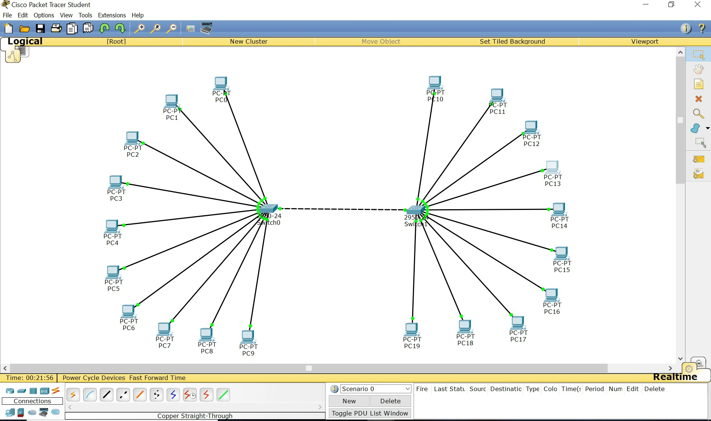
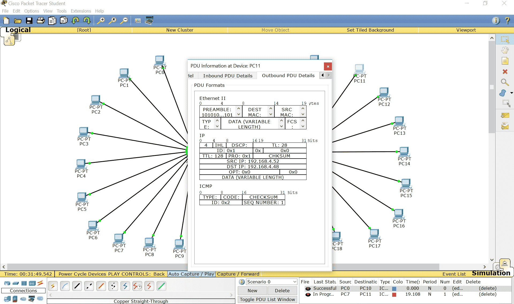
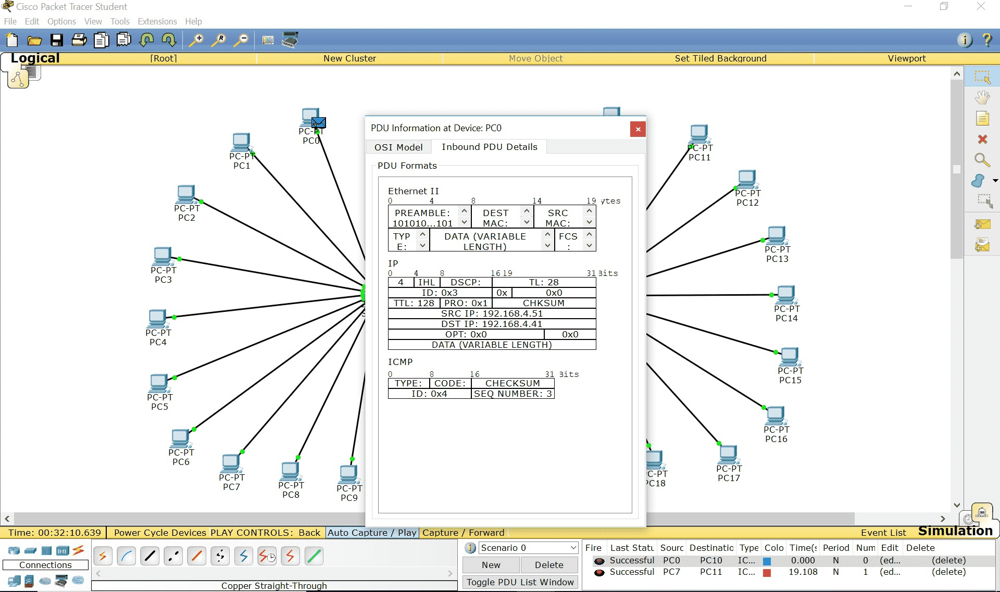
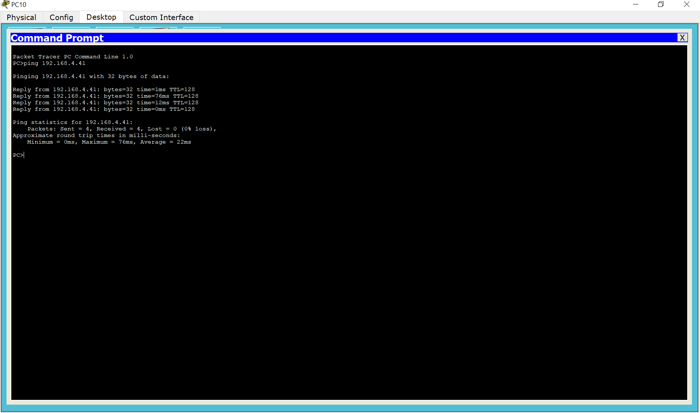

### Configuration and Simulation using CISCO Packet Tracer

Design and Develop a network topology of a 100 Mbps Fast Ethernet LAN having two (2) 24-Port Switches. Each of the Switches is connected with a disjoint set of 10 nodes/ PCs configured with class C IP Address (192.168.4.41-60). Also add PDU to check ping implementing simulation using Cisco Packet Tracer.

### Procedure:

1. Access the Cisco Packet Tracer application in your system.

1. Now, from the bottom left drag and drop two 24-Port Switches from the "Switches" category onto the workspace.

1. Connect the switches using a crossover cable. Click on the "Connections" tab, select "Copper Straight-through" and connect the switches.

1. Drag and drop 10 PCs onto each switch. Connect each PC to a switch using straight-through cables.

1. Double-click on each PC, go to the "Desktop" tab, and select the "IP Configuration" option.

1. Assign IP addresses to the PCs in the range 192.168.4.41 to 192.168.4.50 for the first switch and 192.168.4.51 to 192.168.4.60 for the second switch.

1. From the "End Devices" category, drag and drop a "Generic PDU" (Packet Delivery Unit) near one of the PCs.

1. Click on the "Simulation" tab at the bottom .Then set the simulation time and click the "Start Simulation" button.

1. Click on the PDU and select "Command Line" to send a ping command (e.g. ping 192.168.4.42 ) to test connectivity.

### Observations

**Network Configuration**

**Inbound PDA Details**

**Outbound PDA Details**

**Ping**

